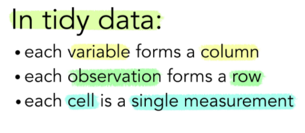
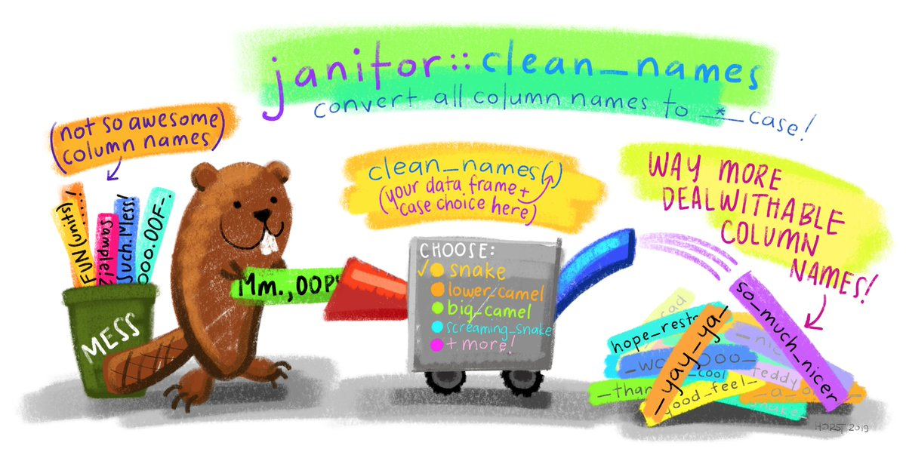
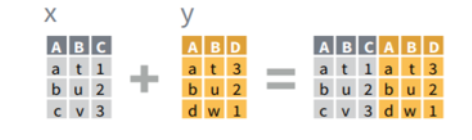
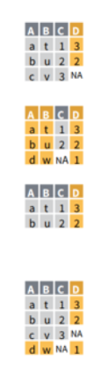

```{r setup, include=FALSE}
options(htmltools.dir.version = FALSE)
```

```{r xaringan-themer, include=FALSE, warning=FALSE}
library(xaringanthemer)
library(dplyr)
library(guaguas)

dark_yellow <- "#9667db"
light_yellow <- "#F7E9FD"
gray <- "#333333"
blue <- "#4466B0"

style_duo(
  # colors
  primary_color = light_yellow,
  secondary_color = dark_yellow,
  header_color = gray,
  text_color = gray,
  code_inline_color = colorspace::lighten(gray),
  text_bold_color = colorspace::lighten(gray),
  link_color = blue,
  title_slide_text_color = blue,

  # fonts
  header_font_google = google_font("Martel", "300", "400"),
  text_font_google = google_font("Lato"),
  code_font_google = google_font("Fira Mono")
)
```

```{r echo=FALSE,include=FALSE}
#pagedown::chrome_print(input="1.-trasponer.html",output="pdf/1. trasponer.pdf")
```

class: inverse, center, title-slide, middle

<style>
.title-slide .remark-slide-number {
  display: none;
}
</style>

# Taller R - Rifa Valentina

## Pivotear y combinar data

### [Nicolás Ratto](https://github.com/nicolasrattor/)

### `2022/02/02`

<a href="https://github.com/nicolasrattor/tallerR_rifa" class="github-corner" aria-label="View source on Github"><svg width="80" height="80" viewBox="0 0 250 250" style="fill:#fff; color:#151513; position: absolute; top: 0; border: 0; right: 0;" aria-hidden="true"><path d="M0,0 L115,115 L130,115 L142,142 L250,250 L250,0 Z"></path><path d="M128.3,109.0 C113.8,99.7 119.0,89.6 119.0,89.6 C122.0,82.7 120.5,78.6 120.5,78.6 C119.2,72.0 123.4,76.3 123.4,76.3 C127.3,80.9 125.5,87.3 125.5,87.3 C122.9,97.6 130.6,101.9 134.4,103.2" fill="currentColor" style="transform-origin: 130px 106px;" class="octo-arm"></path><path d="M115.0,115.0 C114.9,115.1 118.7,116.5 119.8,115.4 L133.7,101.6 C136.9,99.2 139.9,98.4 142.2,98.6 C133.8,88.0 127.5,74.4 143.8,58.0 C148.5,53.4 154.0,51.2 159.7,51.0 C160.3,49.4 163.2,43.6 171.4,40.1 C171.4,40.1 176.1,42.5 178.8,56.2 C183.1,58.6 187.2,61.8 190.9,65.4 C194.5,69.0 197.7,73.2 200.1,77.6 C213.8,80.2 216.3,84.9 216.3,84.9 C212.7,93.1 206.9,96.0 205.4,96.6 C205.1,102.4 203.0,107.8 198.3,112.5 C181.9,128.9 168.3,122.5 157.7,114.1 C157.9,116.9 156.7,120.9 152.7,124.9 L141.0,136.5 C139.8,137.7 141.6,141.9 141.8,141.8 Z" fill="currentColor" class="octo-body"></path></svg></a><style>.github-corner:hover .octo-arm{animation:octocat-wave 560ms ease-in-out}@keyframes octocat-wave{0%,100%{transform:rotate(0)}20%,60%{transform:rotate(-25deg)}40%,80%{transform:rotate(10deg)}}@media (max-width:500px){.github-corner:hover .octo-arm{animation:none}.github-corner .octo-arm{animation:octocat-wave 560ms ease-in-out}}</style>


---

# Contenidos

+ Manipulación avanzada de data frames (funciones `pivot` y combinación de data frames)

+ Manipulación de fechas: paquete `lubridate`

+ Visualización de datos con `ggplot2`

+ Estimar desde diseños muestrales complejos (paquete `survey` y `srvyr`)

+ Hacer funciones, procesos iterativos e introducción a paquetes en R


---

# Contenidos

+ **Manipulación avanzada de data frames (funciones `pivot` y combinación de data frames)**

+ Manipulación de fechas: paquete `lubridate`

+ Visualización de datos con `ggplot2`

+ Estimar desde diseños muestrales complejos (paquete `survey` y `srvyr`)

+ Hacer funciones, procesos iterativos e introducción a paquetes en R

--

+ **Hoy veremos extra de procesamiento: paquete `janitor`**


---

class: inverse, center, middle

# 1. Transformación avanzada de datos

`Pivotear data frames`

---

# Introducción

--

Para elaborar gráficos *elegantes* en R es necesario saber transformar la data previamente

--

Por ejemplo, 

--

+ si queremos graficar N de hogares por región, no nos servirá una base de datos de personas.
  
--
  
+ si queremos graficar mediante barras el porcentaje de personas que reciben mas y menos del sueldo mínimo, la variable numérica salario debe ser categorizada
  
--

+ Si queremos graficar 2 variables, distinguiendo la relación por una tercera, necesitamos tener una base en formato *longer* (hacia abajo), no *wider* (hacia el lado)

--

+ En palabras simples: para visualizar más de dos **series de tiempo**, es ideal pasar la data a formato **longer**

--

Para esto último son necesarias las funciones `pivot_wider()` y `pivot_longer()`

--

Aplicaremos las funciones a datos del paquete `gapminder` y a datos del Banco Mundial.

---

# Pivotear los datos

Alargamiento o ensanchamiento de una data frame.

--

.pull-left[

**Alargamiento:** incremento en el número de filas y decrecimiento del número de columnas

**Ensanchamiento:** incremento en el número de columnas y decrecimiento del número de filas

Para esto utilizaremos las funciones `pivot_wider()` y `pivot_longer()` del paquete `tidyr`

```{r out.width = "20%", fig.pos="h", fig.align="center", echo=FALSE}
knitr::include_graphics("https://tidyr.tidyverse.org/logo.png")
```

]

--

.pull-right[

```{r out.width = "50%", fig.pos="h", fig.align="center", echo=FALSE}
knitr::include_graphics("imagenes/wide-long.png")
```

]


---

## Función pivot_wider()

--

Esta función se utiliza para ordenar un dataframe de forma tal de mostrar categorías de una variable como columnas de un dataframe.

--

Incrementa el número de las columnas y disminuye el número de las filas.

--

Es útil para la presentación de cuadros de resumen con doble entrada.

--

```{r echo=FALSE, message=FALSE}
library(tidyverse)
data <- readRDS("data/Latinobarometro_2020_Esp_Rds_v1_0.rds")
data <- data %>% mutate(posicion_politica = case_when(p18st %in% c(0,1,2,3) ~ "izq",
                                              p18st %in% c(4,5,6) ~ "centro",
                                              p18st %in% c(7,8,9,10) ~ "der",
                                              p18st %in% c(97) ~ "ninguna",
                                              TRUE ~ NA_character_
                                              ))

tabla1 <-data %>%  filter(!is.na(posicion_politica)) %>%  group_by(sexo,posicion_politica) %>% summarise(n=n())
tabla1 %>% knitr::kable()
```


---

## Función pivot_wider()

Ahora vemos las categorías de sexo hacia la derecha

```{r echo=FALSE}

tabla1 %>% 
  tidyr::pivot_wider(names_from = sexo,values_from = n) %>% 
  knitr::kable()
```

--

Pasamos de un formato largo a uno ancho

--

```{r}
library(tidyr)
```

--

```{r eval=FALSE}
data %>%  
  filter(!is.na(posicion_politica)) %>% 
  group_by(sexo,posicion_politica) %>% 
  summarise(n=n()) %>% 
  pivot_wider(names_from = sexo,
              values_from = n) 

```

---

## Función pivot_wider()

Básicamente dos argumentos:

+ *names_from:* categorías que se quiere convertir en columnas

+ *values_from:* columna desde la cual extraer los valores

--

Además, podemos usar el argumento `names_prefix` cuando tenemos números

```{r message=FALSE}
data %>% filter(!is.na(posicion_politica)) %>% 
  group_by(sexo,posicion_politica) %>% 
  summarise(n=n()) %>% 
  pivot_wider(names_from = sexo,
              values_from = n,
              names_prefix = "sexo_") 
```


---

## Función pivot_longer()

Esta función se puede considerar como la opuesta a pivot_wider().

--

Esta función incrementa el número de filas y disminuye el número de columnas.

--

Los dataframes obtenidos por esta función son más fáciles de manipular, pero son poco presentables

--

```{r}
df1 <- data.frame(region = c(1, 2),
                  hombres = c(100, 200),
                  mujeres = c(50, 300))
df1
```

---

## Función pivot_longer()

```{r}
df1 %>%
  pivot_longer(cols = c(hombres,mujeres) )
```


--

El argumento principal es cols:

+ *cols:* columnas a las que se le aplicará la operación (que se convertirán en categorías de una nueva variable)

---

## Función pivot_longer()

Además, se pueden especificar los nombres de las columnas "name" y "value"

+ *names_to:* indica el nombre de la variable que será creada para "guardar" los nombres de las categorías.

+ *values_to:* indica el nombre de la variable que será creada para "guardar" los valores asociados a las categorías.


--

```{r}
df1 %>%
  pivot_longer(cols = c(hombres,mujeres) , 
               names_to = "sexo", values_to = "total_sexo")
```


---

# Pivotear los datos

Relevante para visualizar (ggplot2) y para trabajar datos importados

--

Por ejemplo, descarguemos datos de Afganistán

--

```{r out.width = "80%", fig.pos="h", fig.align="center", echo=FALSE, fig.link="https://datos.bancomundial.org/"}

```

---

# Pivotear los datos

¿Cómo vienen los datos?

--

```{r}
afganistan <- readxl::read_excel("data/API_AFG_DS2_es_excel_v2_3162018.xls",
                                 skip = 3)
```

--

```{r echo=FALSE}
afganistan[1:4,c(2,3,50,57)]                                                %>% knitr::kable()
```

--

.center[.inverse[¡Las variables vienen como filas!]]

---

# Pivotear los datos

La data no es un dato ordenado (*tidy data*)

--

```{r out.width = "50%", fig.pos="h", fig.align="center", echo=FALSE}

```

--

¿Como graficamos el PIB de Afganistan si no es una variable? Solo podemos tabular años, lo que no tiene sentido:

--

```{r eval=FALSE}
table(afganistan$`1962`)
```

--

```{r echo=FALSE}
table(afganistan$`1962`)[1:8]
```


---

# Pivotear los datos

La solución es **pivotear** los datos (dos veces)

--

```{r}
# Alargar la data
afganistan <- afganistan %>% pivot_longer(5:ncol(afganistan)) %>% 
  select(-`Country Name`,`Country Code`,`Indicator Code`) 

```

--

```{r}
# Quitar filas repetidas para evitar errores
afganistan <- afganistan %>% 
  distinct(`Indicator Name`,value,name)

```

--

```{r}
# Ensanchar la data
afganistan <- afganistan %>% 
  tidyr::pivot_wider(names_from = `Indicator Name`, 
                                  values_from = value,
                                  values_fn = {sum}) 
```

--

```{r}
# Limpiar los nombres
afganistan <- afganistan %>% 
  janitor::clean_names() %>% rename(anio=name)
```

---

# Pivotear los datos

```{r echo=FALSE}
afganistan[c(53:61),
           c("anio","ingreso_nacional_bruto_ing_us","poblacion_total")]     %>% knitr::kable()
```


---

# Visualizar una variable

```{r fig.align='center', out.width="50%"}
plot(afganistan$anio,afganistan$poblacion_total,type = "l")
```

---

# ¿Que diablos hicimos?

--

```{r echo=FALSE}
afganistan <- readxl::read_excel("data/API_AFG_DS2_es_excel_v2_3162018.xls",
                                 skip = 3)
```

## 1. Alargar la data

```{r eval=FALSE}
afganistan <- afganistan %>% pivot_longer(5:ncol(afganistan))  %>% 
  select(-`Country Name`,-`Country Code`,-`Indicator Code`) # y quitar basura
```

--

```{r echo=FALSE}
afganistan <- afganistan %>% pivot_longer(5:ncol(afganistan)) %>% 
  select(-`Country Name`,-`Country Code`,-`Indicator Code`)
afganistan[c(150:155),]
```


---

## 2. Quitar filas repetidas

```{r}
afganistan <- afganistan %>% 
  distinct(`Indicator Name`,value,name)

afganistan <- afganistan %>% 
  distinct(`Indicator Name`,name,.keep_all = TRUE)

```

--

```{r echo=FALSE}
afganistan[c(150:155),]
```


---

## 3. Ensanchar la data

```{r}
afganistan <- afganistan %>% 
  tidyr::pivot_wider(names_from = `Indicator Name`, 
                                  values_from = value,
                                  values_fn = {sum}) # sumar repetidos
```

--

```{r echo=FALSE}
afganistan[c(50:55),c(1,4,8)]
```


---

# 4. Limpiar los nombres

```{r}
names(afganistan)[1:3]
```

--

```{r}
afganistan <- afganistan %>% janitor::clean_names() %>% 
  rename(anio=name)
```

--

```{r}
names(afganistan)[1:3]
```

---

# Janitor

```{r out.width = "90%", fig.pos="h", fig.align="center", echo=FALSE}

```


---

# Visualizar muchas variables

--

## Primero alargar...

--

```{r fig.align='center', out.width="50%"}
data <- afganistan %>% 
  select(anio,starts_with("poblacion"))

data <- data[,c(1:10)] %>% pivot_longer(c(2:ncol(.)))
```

--

```{r echo=FALSE}
data %>% head()
```


---

## ...Luego visualizar

--

```{r echo=FALSE,fig.align='center', out.width="50%", warning=FALSE}
data %>% mutate(anio=as.numeric(anio)) %>% 
  ggplot(aes(x=anio,y=value,color=name))+
  geom_line() +
  facet_wrap(~name,scales = "free") +
  theme(legend.position = "none")
```


---

class: inverse, center, middle

# 2. Combinar data frame

`Combinación de data frames usando llaves en merge`

---

# Repaso: sin llaves

--

Para pegar columnas: `cbind()` 

--

Para pegar filas, una bajo la otra `bind()` 

--

```{r fig.align='center', out.width = "40%", echo=FALSE}
knitr::include_graphics("https://opinionessobreciencia.files.wordpress.com/2016/06/bind-abajo.png")
```

--

Limitación: `rbind()` solo cuando las variables se llaman igual.

--

Por otro lado, `cbind()` combina cuando existe el mismo número de filas.

--

`bind_rows()` y `col_rows()` son las versiones `dplyr` más flexibles para la combinación.

--

Sin embargo, todas estas opciones pegan filas y columnas, sin considerar identificadores de las unidades (llaves)


---

# merge()

.pull-left[

#### La lógica de bind_rows()

```{r fig.align='center', out.width = "75%", echo=FALSE}

```

#### Para especificar el tipo de merge()

`all.x=TRUE`


`all.y=TRUE`


`all=FALSE`


`all=TRUE`


]

.pull-right[

#### La lógica de merge()

```{r fig.align='center', out.width = "25%", echo=FALSE}

```
]

---

# merge()

La función tiene 4 argumentos fundamentales

```{r eval=FALSE}
merge(x, y, by="key", all.x=FALSE)
```

--

+ `x` es la data 1

+ `y` es la data 2

+ "key" es la variable llave usada para combinar

+ con `all` indicamos si queremos mantener los valores de x, de y, de todas o de ninguna


---

# merge()

Crear dos bases de datos

```{r}
songs <- tibble(song = c("Come Together", "Dream On", 
                         "Hello,Goodbye", "It's Not Unusual"),
                album  = c("Abbey Road", "Aerosmith", 
                           "Magical Mystery Tour", "Along Came Jones"),
                first = c("John", "Steven", "Paul", "Tom"),
                last = c("Lennon", "Tyler", "McCartney", "Jones"))

albums <- tibble( album = c("A Hard Day's Night", 
                         "Magical Mystery Tour", "Beggar's Banquet",
                        "Abbey Road", "Led Zeppelin IV", 
                        "The Dark Side of the Moon",
                        "Aerosmith", "Rumours", "Hotel California"),
                  band = c("The Beatles", "The Beatles", 
                           "The Rolling Stones",
                           "The Beatles", "Led Zeppelin", 
                           "Pink Floyd", "Aerosmith",
                           "Fleetwood Mac", "Eagles"),
               year = c(1964,1967,1968,1969,1971,1973,1973,1977,1982))
```


---

# merge()

¿Que variable tienen en común songs y albums?

--

.inverse[album], por lo que será la llave.

--

```{r}
merge(albums,songs, by="album", all = TRUE)                                      %>% knitr::kable()
```

---

# merge()

Probemos con `all=FALSE`

```{r}
merge(albums,songs, by="album", all = FALSE)                                     %>% knitr::kable()
```

--

¿Que sucedió?

--

Solo se mantienen las observaciones que simultáneamente están en X y en Y


---

# merge()

Quedarse con todos los valores de x (`all.x=TRUE`)

```{r}
merge(albums,songs, by="album", all.x = TRUE)                                      %>% knitr::kable()
```

---

# merge()

Quedarse con todos los valores de y (`all.y=TRUE`)

```{r}
merge(albums,songs, by="album", all.y = TRUE)                                    %>% knitr::kable()
```


---

# merge()

#### Para cerrar

--

¿Podemos usar más de una llave?

--

Sí, con `by=c("var1","var2")`

--

¿Se puede combinar más de una data frame al mismo tiempo? 

--

Sí, teóricamente infinitas hasta que colapse la memoria del pc:

--

```{r eval=FALSE}
Reduce(function(x, y) merge(x, y), list(x, y, z, etc))
```

Deben escribirse dentro de `list()`

--

Con comandos más avanzados se pueden leer y combinar todas las bases de datos de una carpeta del computador o del ambiente (lo veremos en sesión 5).


---

### Recursos utilizados

[Xaringan: Presentation Ninja, de Yihui Xie](https://github.com/yihui/xaringan). Para generar esta presentación.

[Ilustraciones de Allison Horst](https://github.com/allisonhorst/stats-illustrations)

[Capacitación INE tidy data](https://capacitacion-r-basico.github.io/sesion_3/#85)

[Funciones merge() en R](https://r-coder.com/funcion-merge-r/)

[Paquete Janitor](http://sfirke.github.io/janitor/)

