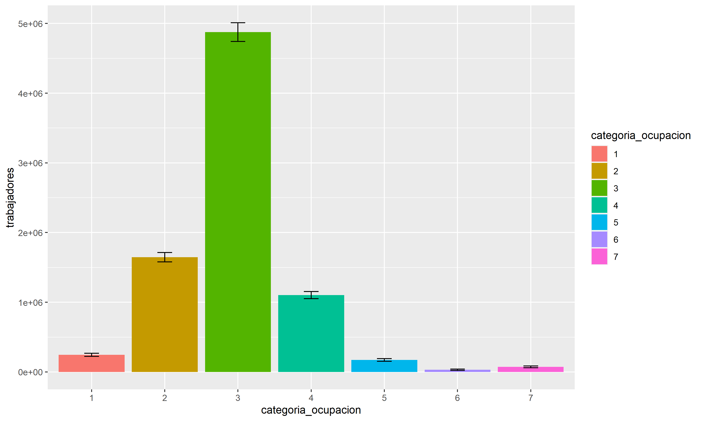
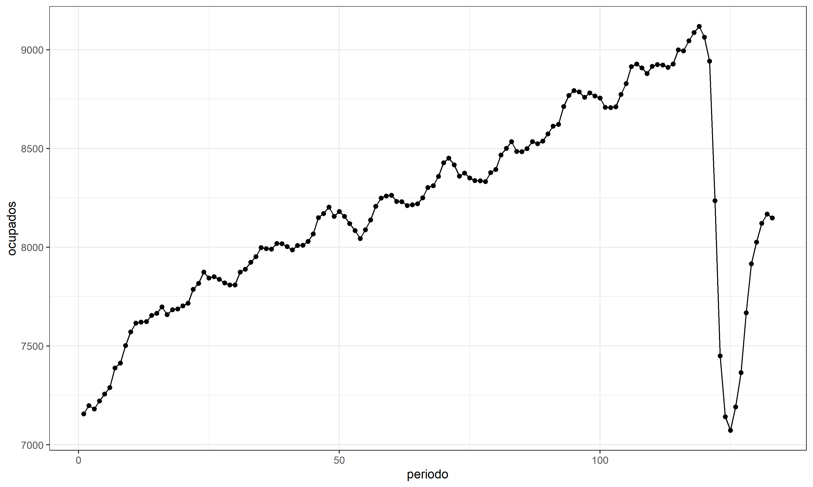
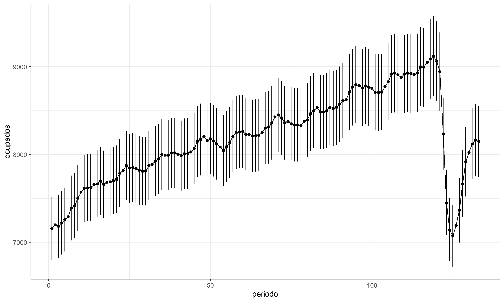

```{r setup, include=FALSE}
options(htmltools.dir.version = FALSE)
```

```{r xaringan-themer, include=FALSE, warning=FALSE}
library(xaringanthemer)
library(dplyr)
library(guaguas)
library(knitr)

dark_yellow <- "#9667db"
light_yellow <- "#F7E9FD"
gray <- "#333333"
blue <- "#4466B0"

style_duo(
  # colors
  primary_color = light_yellow,
  secondary_color = dark_yellow,
  header_color = gray,
  text_color = gray,
  code_inline_color = colorspace::lighten(gray),
  text_bold_color = colorspace::lighten(gray),
  link_color = blue,
  title_slide_text_color = blue,

  # fonts
  header_font_google = google_font("Martel", "300", "400"),
  text_font_google = google_font("Lato"),
  code_font_google = google_font("Fira Mono")
)
```

```{r echo=FALSE,include=FALSE}
#pagedown::chrome_print(input="4.-survey.html",output="pdf/4. survey.pdf")
```


# Contenidos

+ Manipulación avanzada de data frames (funciones `pivot` y combinación de data frames)

+ Manipulación de fechas: paquete `lubridate`

+ Visualización de datos con `ggplot2`

+ **Estimar desde diseños muestrales complejos (paquete `survey` y `srvyr`)**

+ Hacer funciones, procesos iterativos e introducción a paquetes en R

---

class: inverse, center, middle

# Muestras complejas en R

`Inferencia a la población`

---

# El desafío de la inferencia

La reducción de costos y esfuerzos que implica estudiar una población mediante una muestra, se compensa con el costo de la "incertidumbre" o "imprecisión".

--

La estadística nos da elementos para conocer y manejar esta incertidumbre.

--

Desde nuestra muestra vamos a estimar o inferir un valor aproximado del parámetro de la población. 

--

Al hacer este proceso, no solo ocuparemos estimaciones puntuales (como medias, quntiles, medianas, etc.)

--

También tendremos que calcular la precisión de estas estimaciones 

--

Todo estimador está compuesto por dos elementos

+ Estimación puntual
+ Precisión (ci, se, var, cv)

---

# Ej. Reporte de estimación

```{r echo=FALSE, fig.align='center',out.width="70%",fig.link="https://www.ine.cl/docs/default-source/seguridad-ciudadana/publicaciones-y-anuarios/2020/s%C3%ADntesis-de-resultados---17-enusc-2020.pdf?sfvrsn=f57d6dc6_2"}
knitr::include_graphics('imagenes/enusc.png')
```

---

# Ej. Reporte de estimación

```{r echo=FALSE, fig.align='center',out.width="70%",fig.link="https://www.ine.cl/docs/default-source/seguridad-ciudadana/publicaciones-y-anuarios/2020/s%C3%ADntesis-de-resultados---17-enusc-2020.pdf?sfvrsn=f57d6dc6_2"}
knitr::include_graphics('imagenes/enusc2.png')
```

---

## Muestreo influye en inferencia

```{r echo=FALSE, fig.align='center',out.width="70%"}
knitr::include_graphics('imagenes/estratos_conglomerados_lohr.png')
```

---


# La forma incorrecta

Para estimar el valor del parámetro poblacional se requieren dos pasos: 

--

+ definir un estadístico como estimación del parámetro poblacional (estimación puntual) 

--

+ establecer en torno a un estadístico un intervalo de confianza para estimar en términos probabilísticos el parámetro. 

--

Lo apropiado es reportar ambas cosas, pero es difícil cuando tenemos un **diseño muestral complejo**.

--

Para la estimación puntual, solo necesitaremos el peso de cada unidad de nuestros datos (`weight`)

--

Este **ponderador** o **factor de expansión (FE)** indica a cuántas unidades representa cada elemento de la muestra. 

--

Los pesos **no** dan información acerca de la forma de determinar los errores estándar, siendo centrales para calcular los IC (precisión). 

--

**Desv Est.** tiende a aumentar con conglomerados y a disminuir con estratos...


---

# Abramos R

Una vez más, trabajaremos con la Encuesta Nacional de Empleo. 

--

¿Cuántes personas ocupadas existían en Chile en trimestre Ene-Mar 2021? [Consultar acá](https://www.ine.cl/docs/default-source/ocupacion-y-desocupacion/cuadros-estadisticos/series-de-tiempo-nueva-calibraci%C3%B3n-proyecciones-de-poblaci%C3%B3n-censo-2017/indicadores_principales.xlsx?sfvrsn=afbd6d15_58)

--

8.148.210 ocupados: 4.826.060 hombres (59,2%) y 3.322.150 mujeres (40,8%). 

--

¿Como podemos reproducir este resultado desde la base de datos?

--

```{r eval=FALSE}
# Descargar la base de datos
ene <- read.csv(file = "https://www.ine.cl/docs/default-source/ocupacion-y-desocupacion/bbdd/2021/formato-csv/ene-2021-02-efm.csv?sfvrsn=6d3786e2_4&download=true",sep = ";")
```

```{r echo=FALSE}
# Descargar la base de datos
ene <- read.csv(file = "data/ene-2021-02-efm.csv",sep = ";")
```


--

```{r}
ene %>% filter(activ==1) %>%
  group_by(sexo) %>% summarise(ocup=n()) %>% mutate(prop=ocup/sum(ocup))
```


---

# Abramos R

ENE es un diseño por conglomerados, bietápico y estratificado. 

--

Para estimar **puntualmente** de manera correcta necesitamos los **factores de expansión**

--

¿Como se comporta esta variable?

--

```{r}
summary(ene$fact_cal)
```

--

.center[.inverse[¿Cuánto debería sumar?]]

--

```{r echo=FALSE}
sum(ene$fact_cal)  
```


---

# Abramos R

Ahora filtramos para dejar solo los ocupados y agrupamos por sexo.

--

```{r}
ene %>% filter(activ==1) %>% 
  group_by(sexo) %>% 
  summarise(ocupados=sum(fact_cal)) 
```

--

Y el total de ocupados

--

```{r}
sum(ene[ene$activ==1,]$fact_cal,na.rm = TRUE)
```

---

## Uso de estimaciones puntuales

Si bien es una mala práctica, tiene buen rendimiento y se usa en estudios descriptivos. 

--

El mismo INE presenta las estimaciones puntuales sin advertencia de su precisión*. 

--

```{r echo=FALSE, fig.align='center',out.width="60%"}
knitr::include_graphics('imagenes/ine_boletin.png')
```

--

*En los tabulados se señala cuando las estimaciones son poco o nada fiables


---

## Medir la precisión de la estimación

Si solo nos interesa la estimación puntual, podríamos simplemente usar el peso de cada caso y olvidarnos del resto. 

--

Sin embargo, debemos ser capaces de conocer la precisión de nuestras estimaciones y poder determinar, al menos, si son significativamente diferentes de cero.

--

Para esto debemos suponer cosas, conocer la error estándar de nuestra variable, el nivel de confianza con el que estamos trabajando y otros elementos del diseño muestral. 


---

## Medir la precisión de la estimación

Si la ENE fuera un simple Muestreo Aleatorio Simple, el intervalo en torno a las proporciones de hombres y mujeres se podría obtener definiendo:

--

n = 90.387, z = 1.96, (pxq): 0.4691383*0.5308617

--

```{r}
p <- as.vector(prop.table(table(ene$sexo)))[1]
n <- nrow(ene)
z <- 1.96 # para 95% de confianza
```

--

```{r}
ci_p <- z * (sqrt(p*(1-p)/n))
(p-ci_p)*100 ; p*100 ; (p+ci_p)*100
```

--

Sin embargo, es un diseño complejo. Estimamos mal todo.  

---


## La forma correcta: `survey` y `srvyr`

Para trabajar con muestras complejas en R son necesarios dos paquetes:

--

.pull-left[

`survey`

`srvyr`

]

--

.pull-right[

```{r echo=FALSE, out.width="30%", fig.link="https://unidirectory.auckland.ac.nz/profile/t-lumley"}
knitr::include_graphics('https://unidirectory.auckland.ac.nz/people/imageraw/t-lumley/10506857/biggest')
```

]

--

El primero fue creado por [Thomas Lumley](https://unidirectory.auckland.ac.nz/profile/t-lumley). 

El segundo es su adaptación por terceros para que dialogue con la gramática de `dplyr` y los `pipes`. 

--

```{r eval=FALSE}

## Crear objeto tbl_svy
ds <- data %>% 
  as_survey_design(ids = conglomerados, # ids=1 (no hay conglomerado)
                   strata = estratos, 
                   weights = pesos)
```


---

# Diseño ENE

Muestreo bietápico -> conglomerados -> vivienda

--

+ Unidad primaria de muestreo (UPM) definida como un conglomerado homogéneo, en
términos de la cantidad de viviendas particulares que los componen. 35.140 upm

--

+ Unidad secundaria de muestreo (USM) que corresponde a viviendas particulares ocupadas dentro de las UPM seleccionadas. 6.145.493 viviendas

--

La muestra de la ENE fue seleccionada desde el **Marco Muestral** de Viviendas (MMV) elaborado con Censo 2017.

--

El MMV contiene variables que permiten la clasificación de las UPM en:

+ area rural / urbana

+ comuna

+ Tres niveles socioeconómicos

--

Se seleccionan 39.000 viviendas en 5.000 UPM aprox. 


--

Fuente: [Diseño metodológico ENE](https://www.ine.cl/docs/default-source/ocupacion-y-desocupacion/metodologia/espanol/metodolog%C3%ADa-encuesta-nacional-de-empleo-ene-2020.pdf?sfvrsn=793380e9_8)

---

## La forma correcta: `survey` y `srvyr`

Todo este diseño se contiene en variables de la base de datos

--

```{r}
ene %>% select(idrph,id_identificacion,estrato,
               conglomerado,fact_cal) %>% head()
```
--

+ Primer paso es cargar los paquetes

```{r message=FALSE, warning=FALSE}
library(survey)
library(srvyr)
```


---

## `survey` y `srvyr`

+ Lo segundo es crear objeto .inverse[survey] con la ENE

--

Este objeto será del tipo `lista` en R y lo utilizaremos como si fuese la data frame

--

Todas las recodificaciones y ediciones hacerlas antes de crear el objeto `survey`.

--

Las variables con las que se harán agrupamientos deben mutarse a formato `factor`.  

--

```{r}
ene$activ<-as.factor(ene$activ) ## ojo
ene$sexo<-as.factor(ene$sexo) ## ojo
ene$categoria_ocupacion<-as.factor(ene$categoria_ocupacion)  ## ojo
```

--

Crear el objeto `survey`

```{r}
ds <- ene %>% as_survey_design(ids = conglomerado,   
                              strata = estrato,     
                              weights = fact_cal)   
```


---

## `survey` y `srvyr`

--

Podemos agregar la corrección población finita para cada estrato con el argumento `fpc`

--

Esto aumenta la precisión de las estimaciones, pero no lo haremos acá para no complicar más las cosas (ver anexo al final con código)

--

+ Lo tercero es definir algunas opciones generales

Cuando solo hay un conglomerado en un estrato, R no consigue calcular la varianza y arroja error (no se puede calcular varianza con una sola unidad). 

--

Para solucionarlo indicamos que estos conglomerados solitarios no aporten a la varianza.

```{r}
options(survey.lonely.psu = "certainty" ) 
```


---

## `survey` y `srvyr`

Y tenemos nuestro objeto `survey` llamado ds

--

```{r}
class(ds) ## Consultar tipo de objeto
```

--

+ Hagamos nuestra primera estimación: número de personas por actividad

--

```{r}
# Ocupados - Desocupados - Fuera de la FT
ds %>% 
  group_by(activ) %>% 
  summarise(trabajadores=survey_total(na.rm = TRUE))  

```


---

## `survey` y `srvyr`

Ya no solo aparece la estimación puntual, se agrega medida de precisión.

--

Error estándar indica la variabilidad de las medias muestrales. 

--

Como la desviación estándar de la población rara vez se conoce, el error estándar de la media suele estimarse como la desviación estándar de la muestra dividida por la raíz cuadrada del tamaño de la muestra.

--

Con el error estandar podemos obtener los intervalos de confianza


--

$$[\overline{x} + z_{a/2}\frac{sd}{\sqrt{n}} , \overline{x} - z_{a/2}\frac{sd}{\sqrt{n}}]$$

--

¿Hay que seguir haciendo cálculos a mano?

--

No, `survey` lo hace por nosotros...

---

## `survey` y `srvyr`

--

```{r}
ds %>% group_by(activ) %>% 
  summarise(trabajadores=survey_total(na.rm = TRUE,      
                                      vartype=c("ci")))   
```

--

Por defecto `survey` trabaja con nivel de confianza del 95% (z=1,96).

---

## `survey` y `srvyr`

Podemos cambiar el nivel de confianza también. Por ejemplo al 90%

```{r}
ds %>% group_by(activ) %>% 
  summarise(trabajadores=survey_total(na.rm = TRUE, 
                                      vartype=c("ci"),level=c(0.90)))   
```

--

O al 99% (mucha confianza, poca precisión)

--

```{r echo=FALSE}
ds %>% group_by(activ) %>% 
  summarise(trabajadores=survey_total(na.rm = TRUE, 
                                      vartype=c("ci"),level=c(0.99)))   
```

---

## `survey` y `srvyr`

--

Con esto, la tasa de desocupación publicada de 10,4% tendrá incertidumbre.

--

```{r}
tasa<-ds %>% group_by(activ) %>% 
  summarise(trabajadores=survey_total(na.rm = TRUE,  
                         vartype=c("ci")))
```

--

```{r}
tasa <- tasa %>% 
  filter(activ==1|activ==2) %>% # seleccionar ocup y desocup
  janitor::adorn_totals("row")  # total por columna
```
--

Tasas de desocupación:

```{r}
tasa[2,2:4]/tasa[3,2:4]  
```

El error es mínimo (+-0,3%) por el alto número de observaciones (37.589).

---

## `survey` y `srvyr`

¿Cuál sería la tasa de desocupación en la submuestra de las personas de la Región de la Araucanía? (4.728 personas en la muestra)

--

```{r}
tasa<-ds %>% filter(region==9) %>% group_by(activ) %>% 
  summarise(trabajadores=survey_total(na.rm = TRUE,  
                         vartype=c("ci"))) %>% 
  filter(activ==1|activ==2) %>% # seleccionar ocup y desocup
  janitor::adorn_totals("row")
```
```{r echo=FALSE}
tasa
```

--

```{r echo=FALSE}
tasa[2,2:4]/tasa[3,2:4] ## +-1,3%
```

--

Intervalo de +- 1,3%, ya comienza a ser más relevante.

(imaginen el error para una comuna o un grupo específico)

---

## `survey` y `srvyr`

Podemos también estimar los totales de una variable, no solo de las unidades.

--

Horas semanales trabajadas en el país

```{r}
ds %>%
  summarise(c2_1_3= survey_total(c2_1_3,na.rm = TRUE,vartype=c("ci")))
```

--

Teniendo el NT

```{r}
ds %>% filter(activ==1) %>% 
  summarise(nt= survey_total(na.rm = TRUE,vartype=c("ci")))
```
--

Sabemos que en promedio se trabajan 45,6 horas semanales (+- 0,6 horas).

---

## `survey` y `srvyr`

No solo podemos estimar totales, también proporciones, medias, etc.

--

#### Proporciones por categoría de respuesta

--

```{r}

ds %>% filter(categoria_ocupacion!=0) %>% 
  group_by(categoria_ocupacion) %>% 
  summarise(proportion = survey_prop(vartype = c("ci"),na.rm = TRUE)) %>% kable()

```


---

## `survey` y `srvyr`

¿Y que tanto cambian las proporciones sin diseño complejo?

--

.pull-left[

**Con survey**

```{r echo=FALSE}

ds %>% filter(categoria_ocupacion!=0) %>% 
  group_by(categoria_ocupacion) %>% 
  summarise(proportion = survey_prop(na.rm = TRUE)) %>% kable()

```

]

.pull-right[

**Sin survey**

```{r echo=FALSE}

ene %>% filter(categoria_ocupacion!=0) %>% 
  group_by(categoria_ocupacion) %>% 
  summarise(n=n()) %>% mutate(prop=n/sum(n))%>% 
  select(prop) %>% kable()

```

]

---

## `survey` y `srvyr`

#### Media

Función `survey_mean`, incluyendo variable numérica

--

```{r}

ds %>% filter(categoria_ocupacion!=0) %>% group_by(categoria_ocupacion) %>% 
  summarise(media_edad = survey_mean(edad,vartype = c("ci"),na.rm = TRUE))   

```

---

## `survey` y `srvyr`

#### Media

Horas semanales promedio en actividad principal

```{r}

ds %>% filter(categoria_ocupacion!=0) %>% group_by(categoria_ocupacion) %>% 
  summarise(c2_1_3 = survey_mean(c2_1_3,vartype = c("ci"),na.rm = TRUE))   

```

---

### Mediana (2do cuartil)

--

```{r}

ds %>% filter(categoria_ocupacion!=0) %>% 
  group_by(categoria_ocupacion) %>% 
  summarise(c2_1_3 = survey_median(c2_1_3,vartype = c("ci"),na.rm = TRUE))   

```


---

## `survey` y `srvyr`

También se pueden calcular:

#### Cuartiles (y otros percentiles)

```{r eval=FALSE}
ds %>% filter(!is.na(activ)) %>% group_by(activ) %>% 
  summarise(edad=survey_quantile(edad,c(0.25, 0.5, 0.75),na.rm = TRUE))   
```

--

#### Desviación estándar y varianza

```{r eval=FALSE}
ds %>% group_by(categoria_ocupacion) %>% 
  summarise(sd_edad=survey_sd(edad,na.rm = TRUE),
            varianza_edad=survey_var(edad,na.rm = TRUE))   
```


---

class: inverse, center, middle

# Muestras complejas en R

`Visualización de la incertidumbre`

---

# Visualizar la incertidumbre

La forma más común es el gráfico de barras o de líneas con barras de error (A). 

```{r echo=FALSE,fig.align='center', out.width="70%"}
knitr::include_graphics("imagenes/4_mean_ic.png")
```

--

La visualización puede aportar más de un intervalo (B)

--

O incluso se puede ir más allá, visualizando la incertidumbre de forma continua (C y D)

--

La visualización puede confundir, presentándose EE como si fuesen intervalos 

--

Si solo se reporta el EE como IC, se está utilizando un nivel de confianza del 68% (z=1). Si no se explicita, se hace pasar como si fuese de 95% (z=1.96).

IC al 95% es el doble que un IC al 68%.


---

# Visualizar la incertidumbre

#### Gráfico de barras

Para visualizar datos utilizando diseños complejos, el "input" que agreguemos a `ggplot2` ya debe haber sido calculado con `survey`

--

Por ejemplo, trabajadores por categoría en la ocupación.

Primero creamos la tabla con la inferencia. 

--

```{r}
tabla1 <- ds %>% filter(categoria_ocupacion!=0) %>% 
  group_by(categoria_ocupacion) %>% 
  summarise(trabajadores=survey_total(na.rm = TRUE, 
                                      vartype=c("ci")))
tabla1[1:3,] %>% kable()
```

---

# Visualizar la incertidumbre

#### Gráfico de barras

```{r eval=FALSE}
tabla1 %>%   
  ggplot(aes(x=categoria_ocupacion,
             y=trabajadores,
             fill=categoria_ocupacion))+
  geom_bar(stat = "identity") + 
  geom_errorbar(aes(ymin=trabajadores_low, ymax=trabajadores_upp),  
                  width=0.2, position=position_dodge(.9))

```

```{r eval=FALSE, echo=FALSE}
ggsave(
  plot = last_plot(),
  filename = "imagenes/grafico1.png",  
  device = "png",
  dpi = "retina",
  units = "cm",
  width = 25,
  height = 15
)
```

--

```{r echo=FALSE,fig.align='center', out.width="50%"}

```


---

# Visualizar la incertidumbre

#### Gráfico de líneas

Data con la evolución de los ocupados (en miles) en Chile entre 2010 y 2021.

```{r echo=FALSE, message=FALSE}

serie<-readxl::read_excel("data/población-en-edad-de-trabajar-por-situación-en-la-fuerza-de-trabajo.xlsx",sheet = 2,skip = 6)
serie<-serie[1:133,8]
serie$periodo<-c(1:133)
names(serie)<-c("ocupados","periodo")
serie<-serie %>% mutate(ocupados_low=ocupados*0.95,  ## IC ficticios para el gráfico
                 ocupados_upp=ocupados*1.05)         ## IC ficticios para el gráfico

serie

```


---

# Visualizar la incertidumbre

#### Gráfico de líneas sin IC

```{r results=FALSE, eval=FALSE}
serie %>%  ggplot(aes(x=periodo, y=ocupados)) + 
  geom_line() + 
  geom_point() +
  theme_bw()
```


```{r echo=FALSE, eval=FALSE}
ggsave(
  plot = last_plot(),
  filename = "imagenes/grafico2.png",  
  device = "png",
  dpi = "retina",
  units = "cm",
  width = 25,
  height = 15
)
```

```{r echo=FALSE,fig.align='center', out.width="50%"}

```

---

# Visualizar la incertidumbre

#### Gráfico de líneas, con medidas de precisión

```{r results=FALSE, eval=FALSE}
serie %>%  ggplot(aes(x=periodo, y=ocupados)) + 
  geom_line() + 
  geom_point() +
  theme_bw() + 
  geom_errorbar(aes(ymin=ocupados_low, ymax=ocupados_upp), width=.01) 
```


```{r echo=FALSE, eval=FALSE}
ggsave(
  plot = last_plot(),
  filename = "imagenes/grafico3.png",  
  device = "png",
  dpi = "retina",
  units = "cm",
  width = 25,
  height = 15
)
```

```{r echo=FALSE,fig.align='center', out.width="60%"}

```


---

## Correlación con pesos

```{r warning=FALSE, message=FALSE}
## Correlación considerando pesos
library(weights)
ene2<-ene %>% select(edad,c2_1_1,c2_2_1)
weighted_corr<-wtd.cor(ene2, weight = ene$fact_cal)
weighted_corr$correlation

```

--

```{r}
# Correlación considerando sin considerar pesos
cor(ene2, use = "complete.obs")
```

---

# Anexo 1. FPC

Corrección por población finita

```{r eval=FALSE}

## obtener población de cada estrato
ene <- ene %>% group_by(estrato) %>% 
  mutate(pob_estrata=sum(fact_cal)) %>% 
  ungroup()

## RE crear objeto survey incluyendo argumento fpc
ds2 <- ene %>% as_survey_design(ids = conglomerado,   
                              strata = estrato,     
                              weights = fact_cal,
                              fpc=pob_estrata)  

ds2 %>%
  group_by(activ) %>% 
  summarise(trabajadores=survey_total(na.rm = TRUE)) 

```

```{r eval=FALSE, echo=FALSE}
ene$unidad <- rep(1,nrow(ene))

ds2<-survey::svydesign(data=ene,
                       ids=~conglomerado,
                       strata=~estrato,
                       weights=~fact_cal,
                       fpc = ~pob_estrata
                       )

ds2
survey::svytotal(~unidad,ds2)
```


---

# Bibliografía y elementos consultados

Heiss, A. [Uncertainty](https://datavizs21.classes.andrewheiss.com/content/06-content/). En curso "Data Visualization". 

INE. Boletín Mensual DEF 2021 [Encuesta Nacional de Empleo](https://www.ine.cl/estadisticas/sociales/mercado-laboral/ocupacion-y-desocupacion).

[Xaringan: Presentation Ninja, de Yihui Xie](https://github.com/yihui/xaringan). Para generar esta presentación.

[Lehmann et al (2021) Presentación paquete "calidad" en LatinR](https://www.youtube.com/watch?v=ch3bg2bhOmc)

Revisar Correl, M. [Error bars considered harmful](https://ieeexplore.ieee.org/document/6875915) para conocer la discusión

