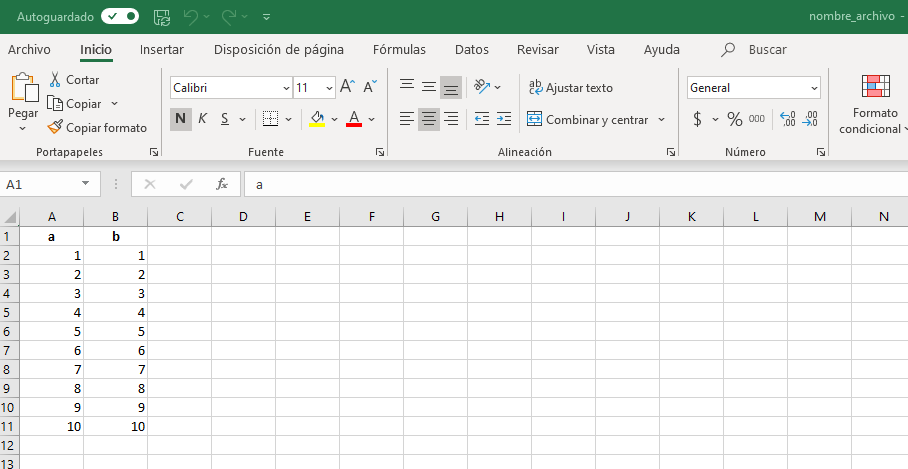
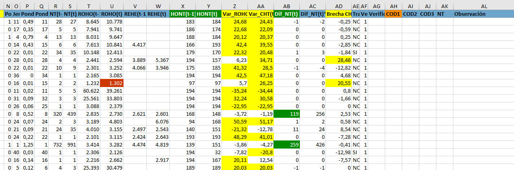
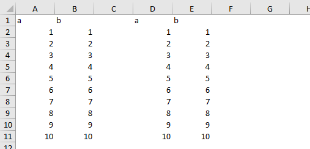
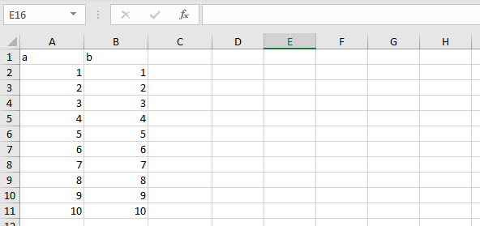
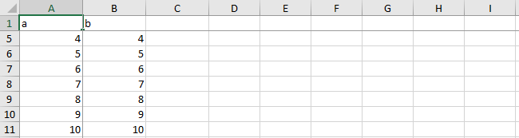
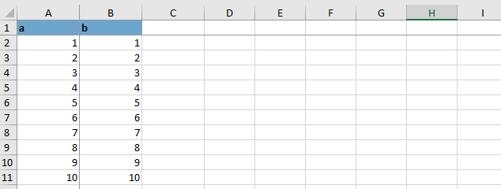
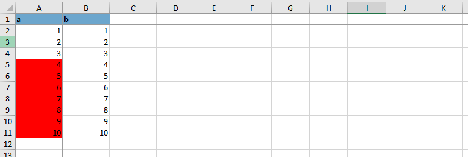
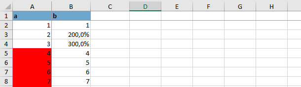
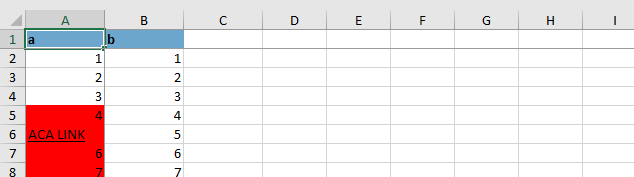

```{r setup, include=FALSE}
options(htmltools.dir.version = FALSE)
```

```{r xaringan-themer, include=FALSE, warning=FALSE}
library(xaringanthemer)
library(dplyr)
library(guaguas)

dark_yellow <- "#9667db"
light_yellow <- "#F7E9FD"
gray <- "#333333"
blue <- "#4466B0"

style_duo(
  # colors
  primary_color = light_yellow,
  secondary_color = dark_yellow,
  header_color = gray,
  text_color = gray,
  code_inline_color = colorspace::lighten(gray),
  text_bold_color = colorspace::lighten(gray),
  link_color = blue,
  title_slide_text_color = blue,

  # fonts
  header_font_google = google_font("Martel", "300", "400"),
  text_font_google = google_font("Lato"),
  code_font_google = google_font("Fira Mono")
)
```

```{r echo=FALSE,include=FALSE}
#pagedown::chrome_print(input="6.-openxlsx.html",output="pdf/6. openxlsx.pdf")
```


# Exportar archivos a excel

--
<br/>

.medium-par[Hay muchas formas de exportar tablas y bases de datos desde R a Excel.]
<br/>
<br/>

--

.medium-par[El proceso resulta fundamental cuando trabajamos en equipos y no todos manejan el lenguaje de R.]
<br/>
<br/>

--

.medium-par[El universo `tidyverse` no cuenta con paquetes para exportar datos a excel en formato `.xlsx`.]
<br/>
<br/>

--

.medium-par[La forma quizás más sencilla y difundida de hacerlo es con el paquete `writexl` (sintaxis sencilla y corta, pero limitada).]
<br/>
<br/>


---

# Exportación con `writexl`

--

.medium-par[En primer lugar creemos una base de datos ficticia:]

--

```{r}
base1<-as.data.frame(cbind(
  a=c(1:10),
  b=c(1:10)
))

head(base1,4)
```

--

.medium-par[Para exportar la base de datos solamente hay que cargar el paquete `writexl` y especificar dos argumentos en la función `write_xlsx`:]

--

```{r warning=FALSE}
library(writexl)          
write_xlsx(base1,          # objeto a exportar (data frame)
  "output/nombre_archivo.xlsx")   # nombre de archivo a crear

```


---


# Exportación con `writexl`

--
<br/>

.medium-par[Por defecto, `write_xlsx` considerará en la exportación el nombre de las columnas y las pondrá centradas y en **negrito**.]


--



---

# Exportación con `writexl`

--

.medium-par[¿Como evitarlo?]

--

Existen dos argumentos extra con los que se puede "jugar" en la función `write_xlsx`: col_names y format_headers.

--

Quitar nombres de columnas:

```{r warning=FALSE}
library(writexl)          
write_xlsx(base1,              # objeto a exportar (data frame)
  "output/nombre_archivo2.xlsx",  # nombre de archivo a crear
  col_names = FALSE,            # Base sin nombres de columnas
  ) 

```

--

Dejar nombre de columnas pero quitarles el formato

```{r warning=FALSE}
library(writexl)          
write_xlsx(base1,              # objeto a exportar (data frame)
  "output/nombre_archivo3.xlsx",  # nombre de archivo a crear
  col_names = TRUE,            # Base con nombres de columnas
  format_headers = FALSE      # Nombres de columnas sin formato
  ) 

```

---

# Exportación con `writexl`

--

Una última posibilidad a revisar con `write_xlsx` tiene que ver con el exportar más de una base de datos en un mismo archivo (un archivo por pestaña).

--

Para esto, las distintas bases de datos a exportar deben agruparse en una lista (`list()`).

--

```{r}
## Se crean dos nuevas bases de datos
base2<-as.data.frame(cbind(c=c(1:10),d=c(1:10)))
base3<-as.data.frame(cbind(e=c(1:10),f=c(1:10)))

```

--

```{r warning=FALSE}
library(writexl)          
write_xlsx(list(base1,base2,base3), # Bases en una lista.
  "output/nombre_archivo4.xlsx",  # nombre de archivo a crear
  ) 
```

---

# Límites de `writexl`

--

En base a los cuatro argumentos de `write_xlsx`, ¿cómo podemos crear un archivo excel como el siguiente?

--

**Extracto base auditoría IR-ICMO**


--

No se puede. Hay que recurrir a funciones de otros paquetes, como `openxlsx`, que pemitirán:

+ Definir formato de celdas (color, color condicional, %, carácter, etc.)
+ Pegar más de una base de datos por pestañas
+ Inmovilizar paneles
+ Muchas cosas más. 


---

# El paquete `openxlsx`

--

En su forma más simple el código resulta más complejo que el de `writexl`:

```{r}
library(openxlsx)

wb <- createWorkbook()  ## Se crea libro de trabajo (wb)

addWorksheet(wb,        ## Al objeto wb le damos una pestaña
      sheetName = "pestaña1", 
      gridLines = FALSE)

writeData(wb = wb,        ## En el libro wb
      sheet = "pestaña1", ## En su pestaña1
      x = base1)          ## Cargamos el objeto base1

saveWorkbook(wb = wb,     ## Exportamos el libro
          file = "output/nombre_archivo5.xlsx", 
          overwrite = TRUE)

```

--

Más complejo, pero vale la pena para tener más control sobre los libros excel que crearemos a futuro. 

--

Lo más simple es copiar y pegar este código cuando quieran exportar, limitándose a cambiar los argumentos según sus objetos y direcciones de trabajo. 


---

# El paquete `openxlsx`

--

.medium-par[Definir posición exacta de objetos en cada pestaña]

Una gran ventaja de `openxlsx` es que en una misma pestaña de excel pueden agregarse dos o más data frames.

--

Esto se logra señalando la posición exacta de cada una:

```{r}

wb2 <- createWorkbook()  ## Se crea libro de trabajo 2 (wb2)

addWorksheet(wb2,        ## Al objeto wb2 le damos una pestaña
      sheetName = "pestaña1", 
      gridLines = FALSE)

writeData(wb = wb2,        ## En el libro wb2
      sheet = "pestaña1", ## En su pestaña1
      x = base1)          ## Cargamos el objeto base1

## Por defecto, base1 se ubica en posición (1,1).

```

--

Pero la posición de los objetos se puede determinar manualmente:

--

```{r}

writeData(wb = wb2,       
      sheet = "pestaña1",
      startCol = 4,   ## Pegar nuevamente base 1 en col 4.
      x = base1)    

```


```{r echo=FALSE}
saveWorkbook(wb = wb2,     ## Exportamos el libro
          file = "output/nombre_archivo12.xlsx", 
          overwrite = TRUE)
```


---

# El paquete `openxlsx`

--

.medium-par[Queda algo así:]



--

Evidentemente, señalándolo correctamente se puede volver agregar la base1 (u otra data frame) en cualquier otra posición de la pestaña1. 

--

```{r}
## Por ejemplo, pegar base1 nuevamente en la columna 8 y fila 20. 
writeData(wb = wb2,       
      sheet = "pestaña1",
      startCol = 8, 
      startRow = 20,
      x = base1)    

## Para ver archivo revisar output de repositorio: "nombre_archivo12.xlsx"

```

```{r echo=FALSE}
saveWorkbook(wb = wb2,     ## Exportamos el libro
          file = "output/nombre_archivo12.xlsx", 
          overwrite = TRUE)
```

---

# El paquete `openxlsx`

--

A continuación se revisan algunos comandos que se pueden agregar entre la creación del objeto wb (Work Book) y su exportación. Específicamente, después de crear pestañas en el libro de trabajo y cargarle los objetos.

Estas modificaciones al libro de trabajo se van agregando progresivamente. 

--

.medium-par[Configurar la anchura de las columnas]

```{r}
## Se repite el proceso de crear WB, dar pestaña y cargar objeto:
wb <- createWorkbook()  

addWorksheet(wb,        
      sheetName = "pestaña1", 
      gridLines = TRUE)

writeData(wb = wb,        
      sheet = "pestaña1", 
      x = base1)        

## Nuevo comando:
setColWidths(wb, 
            sheet = 1, 
          cols = c(1,2,3), ## Columnas a ensanchar 
          widths = 10)      ## Anchura 

```

```{r echo=FALSE, results=FALSE}
saveWorkbook(wb = wb,     ## Exportamos el libro
          file = "output/nombre_archivo6.xlsx", 
          overwrite = TRUE)
```

---

# El paquete `openxlsx`

--

Queda así:




---

# El paquete `openxlsx`

--

.medium-par[Inmovilizar paneles]

```{r}
freezePane(wb,                  ## Libro de trabajo
           sheet= "pestaña1",   ## Pestaña en la que se aplica
           firstRow = TRUE,     ## Inmobilizar fila superior
           firstCol = TRUE)     ## Inmobilizar primera columna

```


```{r echo=FALSE, results=FALSE}
saveWorkbook(wb = wb,     ## Exportamos el libro
          file = "output/nombre_archivo7.xlsx", 
          overwrite = TRUE)
```

--

Queda así:




---

# El paquete `openxlsx`

--

.medium-par[Aplicar colores y estilos]

Se requieren dos pasos: crear el objeto "estilo" y aplicar el objeto "estilo" al libro de trabajo (wb)

```{r}
## Se crea estilo de celda azul, letra negras y ennegrecidas
blue_bold <- createStyle(fontColour = "black",     ## Color letra
                        bgFill = "skyblue3",      ## Color celda
                        textDecoration = "bold")  ## Estilo de la letra

```

```{r}
# Aplicar colores a nombres de columnas
conditionalFormatting(wb, sheet = "pestaña1",   ## libro y pestaña
                      cols = 1:2, ## columna
                      rows = 1,   ## fila
                      rule = "!=0", ## Condición
                      style = blue_bold) ## Aplicar el estilo
```

--

```{r echo=FALSE, results=FALSE}
saveWorkbook(wb = wb,     ## Exportamos el libro
          file = "output/nombre_archivo8.xlsx", 
          overwrite = TRUE)
```

--




---

# El paquete `openxlsx`

--

.medium-par[Aplicar colores y estilos]

También se pueden pintar las celdas si cumplen condición

```{r}
## Se crea estilo de celda azul, letra negras y ennegrecidas
red <- createStyle(fontColour = "black",     ## Color letra
                         bgFill = "red")           ## Color celda

```

--

```{r}
# Aplicar colores a nombres de columnas
conditionalFormatting(wb, sheet = "pestaña1",   ## libro y pestaña
                      cols = 1, ## solo columna 1
                      rows = 2:11,   ## todas las filas, menos la primera
                      rule = ">3", ## Condición mayor a 3
                      style = red) ## Aplicar el estilo
```

--

```{r echo=FALSE, results=FALSE}
saveWorkbook(wb = wb,     ## Exportamos el libro
          file = "output/nombre_archivo9.xlsx", 
          overwrite = TRUE)
```

--




---


# El paquete `openxlsx`

--

.medium-par[Aplicar porcentajes]

Lógica similar a la de los colores. Primero crear un estilo "porcentaje" y luego se aplica. 

```{r}
## Se crea estilo porcentaje (con un decimal)
pct = createStyle(numFmt="0.0%")

## Se aplica estilo porcentaje a las celdas deseadas
addStyle(wb, 
         sheet = 1,  
         style=pct, 
         cols=2, 
         rows=3:4, 
         gridExpand=TRUE)

```

```{r echo=FALSE, results=FALSE}
saveWorkbook(wb = wb,     ## Exportamos el libro
          file = "output/nombre_archivo10.xlsx", 
          overwrite = TRUE)
```

--




---

# El paquete `openxlsx`

--

.medium-par[Hipervínculos]

```{r}
## Creamos nueva pestaña sin agregar objeto

addWorksheet(wb,
      sheetName = "pestaña2", 
      gridLines = FALSE)

## Creamos hipervinculo que nos lleve a la pestaña 2

writeFormula(wb,        ## En libro WB
             "pestaña1",  ## pestaña1 
             startRow = 6, ## En la fila 6, aplica hipervínculo:
             
             x = makeHyperlinkString(sheet = "pestaña2", ## Lleva a pestaña2
                                     row = 1,            ## Fila 1
                                     col = 1,            ## Columna 1
                                     text = "ACA LINK")) ## Texto del link

```

```{r echo=FALSE, results=FALSE}
saveWorkbook(wb = wb,     ## Exportamos el libro
          file = "output/nombre_archivo11.xlsx", 
          overwrite = TRUE)
```

--




---


# Referencias y materiales de consulta

--

[Manual del paquete openxlsx](https://cran.r-project.org/web/packages/openxlsx/openxlsx.pdf).

[Identificación de colores en una imagen](https://imagecolorpicker.com/).

[Colores en R y códigos de colores](http://www.sthda.com/english/wiki/colors-in-r).

